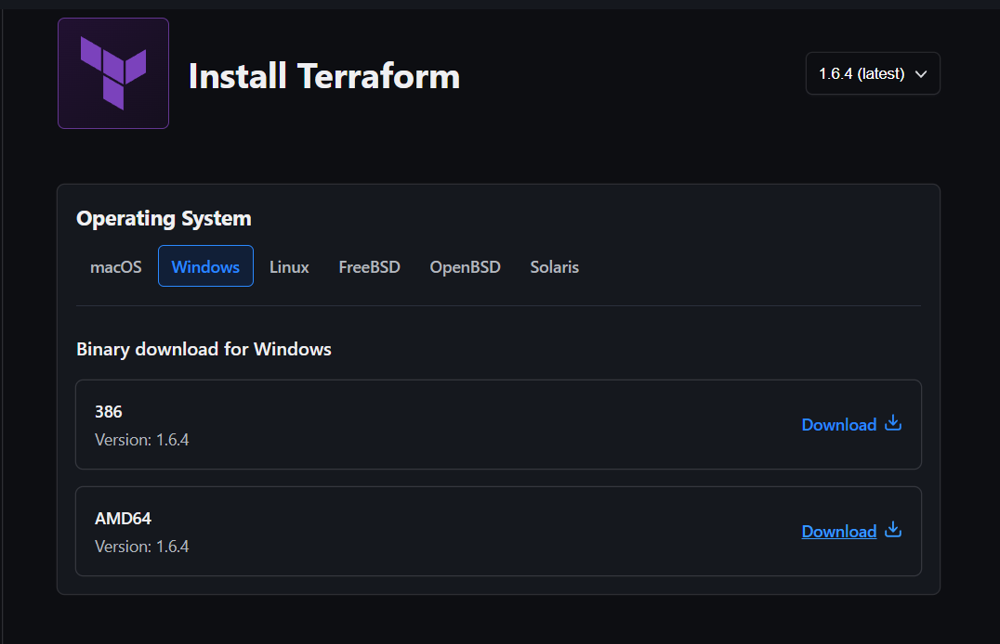
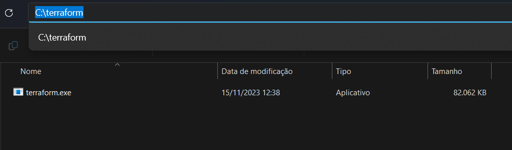
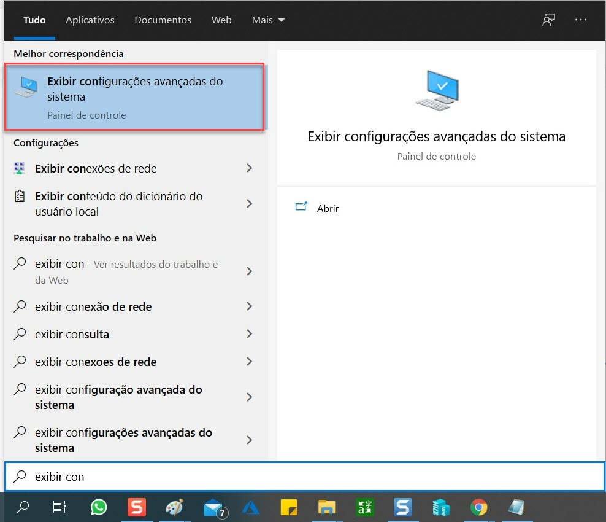
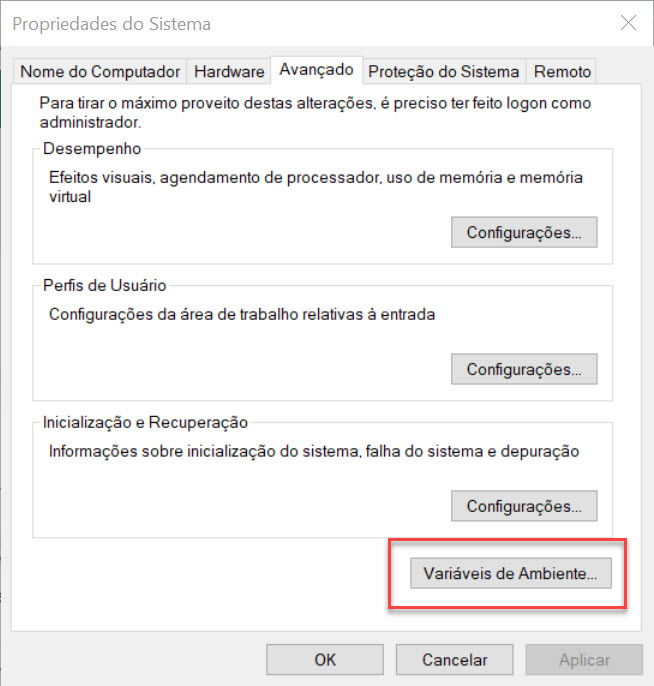
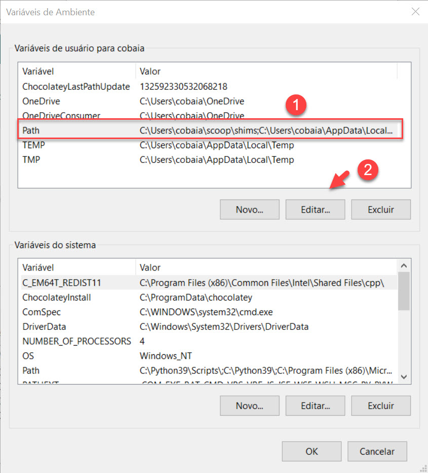
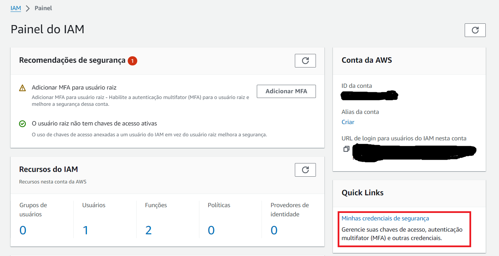
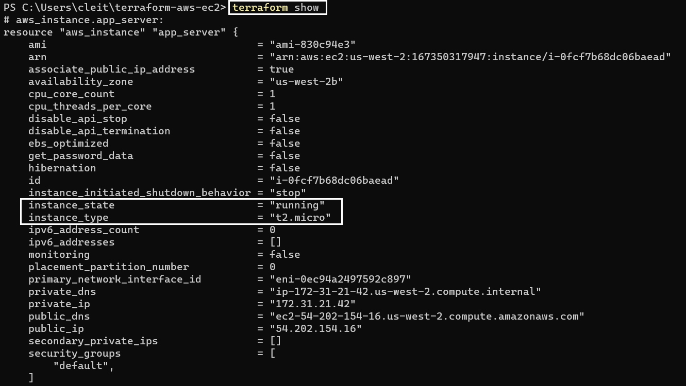

<p align="center">
  <a href="" rel="noopener">
 </a>
</p>

<h1 align="center">Instalando Terraform no Windows e criando o deploy de um instância EC2 na AWS</h1> 
<p align="center"><i>Fazendo a instalação do terraform no Windows e criando o deploy de uma instancia EC2 t2.micro na AWS</i></p>

## 📝 Tabela de conteúdos
- [Fazendo a instalação do Terraform (Passo 1)](#step1)
- [Instalando AWS CLI (Passo 2)](#step2)
- [Fazendo o deploy de uma instância EC2 com Terraform (Passo 3)](#step3)
- [Referências](#documentation)

## 🔽 Fazendo a instalação do Terraform (Passo 1)<a name = "step1"></a>

1. Acesse o site do terraform (https://www.terraform.io/)

2. Na página inicial, clique em Downloads na parte superior do site.

3. Selecione a versão compatível com seu OS.

    

4. Depois de baixar o arquivo zipado, extrai-o na pasta em que ele foi armazenado.

    - O arquivo extraído será o "terraform.exe"

5. Vá para a pasta do Disco C:\, crie uma pasta chamada "terraform" e coloque o arquivo que foi extraído "terraform.exe".

    

7. Adicione o Terraform ao Path do Windows:

- Pesquise por "Exibir configuraçõe avançadas do sistema" na lupa do Windows. 

    

</br>

- A tela **Propriedades do sistema** será exibida, clique em **Variáveis de Ambiente**. 

    

</br>

- Na tela variáveis de Ambiente, clique em **Path –> Editar**. 

    

</br>

- Selecionar a opção Novo, insira o caminho C:\terraform e depois clicar em OK.

    

### Depois de adicionar o caminho do Terraform, clique em "OK" em todas as janela que foram abertas.

- Caso queria validar a configuração do Terraform, abra o PowerShell e use o seguinte comando:

    ```
    terraform --version
    ```

    Exemplo de Resultado:

    ```
    Terraform v1.6.4
    ```

## 🔽 Instalando AWS CLI (Passo 2)<a name = "step2"></a>

1. Faça o download e execute o [AWS CLI MSI installer for windows](https://awscli.amazonaws.com/AWSCLIV2.msi) (64bit):

    ```
    C:\> msiexec.exe /i https://awscli.amazonaws.com/AWSCLIV2.msi
    ```

2. Para confirmar a instalação abra o PowerShell ou cmd e digite o seguinte comando:

    ```
    aws --version
    ```

## ⚙️ Fazendo o deploy de uma instância EC2 com Terraform (Passo 3)<a name = "step3"></a>

1. Para começar, vamos precisar criar chaves de acesso na AWS

- Acesse o IAM
- Vá para "Minhas crendeciais de segurança"
- Em seguida, vá para "criar chaves de acesso"

    

2. No PowerShell, configure a AWS:

    ```
    aws configure
    ```

    - Insira primeiro o ID da chave de acesso e depois a chave privada.

3. Crie uma pasta para colocar os arquivos da sua implantação. (PowerShell)

    ```
    New-Item -ItemType Directory terraform-aws-ec2
    ```

4. Crie um arquivo do terraform dentro da pasta que você criou. (PowerShell)

    ```
    New-Item -ItemType File main.tf
    ```

- Abra no editor de textos (No caso, vou utilizar o VSCode)

    ```
    code main.tf
    ```

5. Configure o arquivo do terraform:

    ```json
    terraform {
      required_providers {
        aws = {
          source  = "hashicorp/aws"
          version = "~> 4.16"
        }
      }

      required_version = ">= 1.2.0"
    }

    provider "aws" {
      region  = "us-west-2"
    }

    resource "aws_instance" "app_server" {
      ami           = "ami-830c94e3"
      instance_type = "t2.micro"

      tags = {
        Name = "ExampleAppServerInstance"
      }
    }
    ```

- Sobre os Code Blocks acima:
    
    - Terraform Block:
        - Esse bloco contém configurações do terraform, incluindo os provedore necessários que o Terraform usará para provisionar sua infraestrutrua.

    - Provider Block:
        - Configura o provedor especificado, neste caso **aws**.
        - Um provedor é um plugin que o terraform usa para criar e gerenciar seus recursos

    - Resources Block: 
        - Serve para definir componentes da sua infraestrutura.
        - Podendo ser um componente físico ou virtual, como uma instância EC2, ou recurso lógico, como um aplicativo Heroku.

6. Iniciando o Terraform no CLI e aplicando a configuração criada.

- Iniciando terraform

    ```
    terraform init
    ```

- Aplicando configuração criado no arquivo "main.tf":

    ```
    terraform apply
    ```

    - Digite "yes" para confirmar a criação da instância quando aparecer "Enter a value:"

    Output (Saída do comando no caso de operação bem sucedida):
    ```
    aws_instance.app_server: Creating...
    aws_instance.app_server: Still creating... [10s elapsed]
    aws_instance.app_server: Still creating... [20s elapsed]
    aws_instance.app_server: Creation complete after 25s [id=i-0fcf7b68dc06baead]
    ```

- Verifique os recursos criados:

    ```
    terraform show
    ```

    

    - **Toda infraestrutura criada/utilizada foi desligada/encerrada no final do desafio.


## Referências utilizadas:<a name="documentation"></a>

- [Instalando o Terraform](https://jadsonalves.com.br/como-instalar-e-configurar-o-terraform-no-windows/)

- [Instalando AWS CLI](https://docs.aws.amazon.com/cli/latest/userguide/getting-started-install.html)

- [Hashicorp - AWS Get Started](https://developer.hashicorp.com/terraform/tutorials/aws-get-started/aws-build)
